  

  <a href="https://github.com/reactivepixels/eko"><code>BOOT 1: eko</code></a>&nbsp;
  <a href="https://github.com/reactivepixels/sparklebios"><code>BOOT 2: sparklebios</code></a>&nbsp;
  <a href="https://github.com/reactivepixels/eko-web"><code>BOOT 3: eko-web</code></a>

  <a href="https://www.rodleviton.com">rodleviton.com</a> · <a href="https://codepen.io/rodleviton">CodePen</a>

